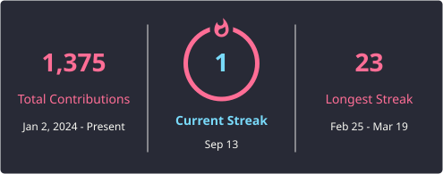

<!-- 🌟 HERO SECTION 🌟 -->

  

  <h1> Welcome to tedacodder's Digital Workspace</h1>

  

   

  <!-- Social Badges -->
  
  

 

 

<!-- 💫 CORE DIRECTIVE 💫 -->

  <h2>💫 Core Directive</h2>

  
I am a <b>4th-Year CS & Engineering Student</b> dedicated to building seamless, high-performance web applications. I thrive at the intersection of complex algorithmic logic and stunning digital design.

  <ul>
    <li>🚀 <b>Currently Engineering:</b> Full-stack architectures using <b>React, Next.js, and Express</b>.</li>
    <li>🧠 <b>Problem Solving:</b> Continuously optimizing logic via <b>Data Structures and Algorithms</b>.</li>
    <li>🌱 <b>Current Objectives:</b> Mastering backend security, deploying scalable databases (<b>PostgreSQL</b>), and contributing to high-impact open-source tools.</li>
  </ul>

 

 

<!-- 🏆 ACHIEVEMENTS 🏆 -->

  <h2>🏆 Achievements</h2>
   
  

 

 

<!-- ⚡ TECH ARSENAL ⚡ -->

  <h2>⚡ Tech Arsenal</h2>
   
  

 

 

<!-- 📊 THE DATA MATRIX (STATS & ACTIVITY) 📊 -->

  <h2>📈 Development Matrix</h2>
   
  
    
  

 

<table border="0" cellpadding="0" cellspacing="0" width="100%" style="border-collapse: collapse; border: none;">
  <tr style="border: none;">
    <td width="50%" align="center" style="border: none;">
      
    </td>
    <td width="50%" align="center" style="border: none;">
      
    </td>
  </tr>
</table>

 

 

<!-- 🚀 FEATURED PROJECTS 🚀 -->
<!-- EDIT ME: swap the repo names in the workflow's pin-card steps to feature your real projects -->

  <h2>🚀 Featured Projects</h2>
   
  
  

 

 

<!-- 🐍 COMMIT SNAKE 🐍 -->

  <h2>🐍 Contribution Ecosystem</h2>
  
<i>The snake consumes my daily contributions...</i>

  <picture>
    <source media="(prefers-color-scheme: dark)" srcset="./generated/snake-dark.svg">
    <source media="(prefers-color-scheme: light)" srcset="./generated/snake.svg">
    
  </picture>

 

 

<!-- 📫 LET'S CONNECT 📫 -->
<!-- EDIT ME: fill in your real LinkedIn / X / portfolio links, or delete any you don't use -->

  <h2>📫 Let's Connect</h2>
   
  
  
  
  

 

 

<!-- 🌐 FOOTER 🌐 -->

  
    
  

<!-- 🌊 ANIMATED WATER WAVE 🌊 -->

  

